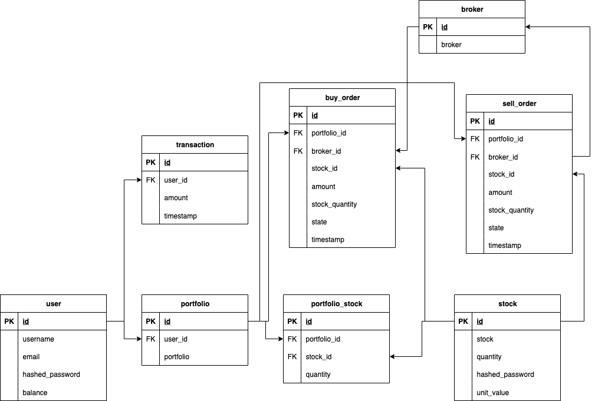

# Racional API  

## Requirements  
- Python 3.12  
- Package Manager: [uv](https://docs.astral.sh/uv/)  

## Install Project Dependencies  
`uv sync`  

## Run  
`uv run task dev`  

## Usage  
- Access the API directly at http://127.0.0.1:8000  
- API documentation is available at http://127.0.0.1:8000/docs, you can run the api directly on the docs! 
- *Remember to log in first  

## Models  
  
AI is used to understand the business rules of Stocks, from which the following data model is derived:  
- **user**: Personal user information, where 'balance' represents the user's account balance.  
- **portfolio**: Corresponds to the "folder" where the user holds their stocks; a user can have multiple portfolios.  
- **transaction**: Money transactions performed by the user, involving deposits or withdrawals of funds.  
- **buy_order**: User's stock purchase orders. Includes attributes like broker ID and state for later configuration, as stock purchases involve multiple stages (though this belongs to another process).  
- **sell_order**: User's stock sell orders. Similar to buy orders, the internal logic validates that the user owns the stocks they are selling.  
- **portfolio_stock**: Declares which stocks belong to each portfolio.  
- **stock**: Records all available stocks in the market.  
- **broker**: The entity responsible for handling stock purchases and sales.  

## Design Decisions  
- **Python** is an easy-to-understand language and quick for building APIs without requiring outstanding performance.  
- **FastAPI** is used for its automatic documentation.  
- **SQLite** simplifies local program execution, and a **relational database** provides structure, consistency, and ease of implementing atomic transactions.  
- **UV** installs versioned packages quickly.  

Would you like any refinements or additional details?

## Workflow  
- AI tools like DeepSeek and ClaudeSonet are used (in chat mode since my GitHub Copilot quota ran out, and I didn’t have time to configure an alternative).  
- To understand the business flow, AI is used alongside reading reference pages to avoid errors from incorrect AI responses, as this is a critical part of accurately grasping the business logic.  
- The data model is diagrammed using Draw.io, then exported as XML, and AI is asked to generate the corresponding SQLAlchemy classes.  
- For API generation, expected code signatures, created models, and functional requirements are provided, followed by manual corrections.  

## Pending Work  
- Verify SQL transactions during critical operations like money transactions or stock buy/sell orders.  
- Improve documentation descriptions.  
- Better implement linters, formatters, and security checks using the libraries installed in pyproject.toml (Bandit, Mypy, Ruff, uv-secure).  
- Separate routes from logic to keep files cleaner.